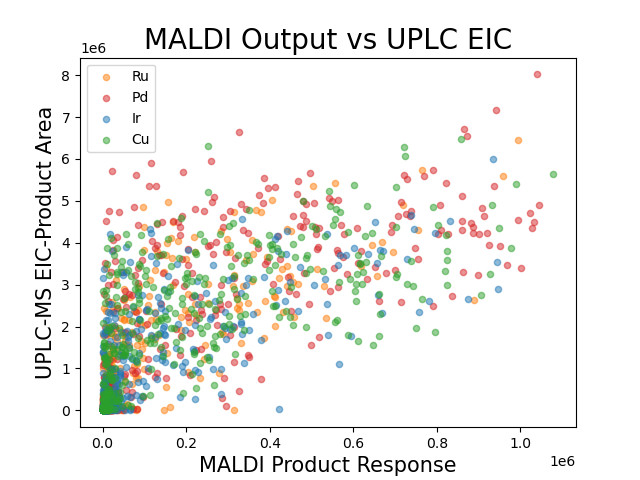

# mapping-chemical-darkspace
## with machine learning and chemical graphs

## Introduction
Making new molecules lies at the heart of many of the most important innovations, from making new and more effective drugs to energy storage.  However, our ability access new  molecules is limited by the reactions we have at our disposal.  Thus, one of the most important thrusts of chemical research is developing robust reactions that can diversify our the pool of molecules we can make.  Reaction development is one of the oldest research fields in any science (think making soap or gunpowder!), yet it still remains a fertile ground for new research.  Chemists are still finding new ways to make bonds between parts of molecules that were previously thought to be impossible, and these advancements have been crucial our ability to make new drugs more efficiently.

## Chemical Darkspace
Discovering a new reaction is only half the battle.  From here, researchers must undergo the difficult task of exploring which molecules that reaction is compatible with.  Some chemical groups will poison the catalyst responsible for reaction, while some reaction conditions are too harsh for certain delicate chemical groups.  For a reaction to be considered robust, and therefore be widely used in industry and academia, it either must be able to tolerate a diversity of functional groups, or we have to have a good sense of what chemical groups won't be tolerated so we know what molecules to avoid with a reaction beforehand. 

Chemical darkspace is a concept that refers to the set of all molecules where a reaction has never been applied.  This unexplored region of chemical space is inconcievably vast because there is an unimaginably large number of combination of atoms and bonds that can make up even a relatively small molecule.  Below is an example of a representation of known and dark chemical space for a certain reaction, with each colored dot representing a molecule or pair of molecules where the reaction has been documented.  

This chemical darkspace is incredibly important for our ability to make advancements in any 

## High-Troughput Experimentation and MALDI

## Data

# Modeling with Random Forest

## Feature Engineering with Chemical Graphs

## Improving Model with Molecular Features

## Conclusion
