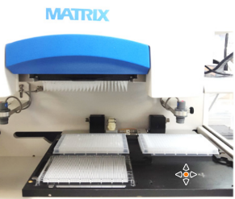
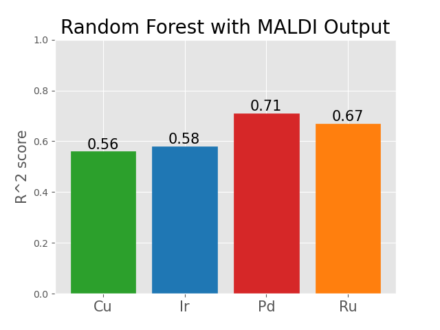

# mapping-chemical-darkspace
**with machine learning and chemical graphs**

## Introduction
Making new molecules lies at the heart of many of the most important innovations, from making new and more effective drugs to energy storage.  However, our ability access new  molecules is limited by the reactions we have at our disposal.  Thus, one of the most important thrusts of chemical research is developing robust reactions that can diversify our the pool of molecules we can make.  Reaction development is one of the oldest research fields in any science (think making soap or gunpowder!), yet it still remains a fertile ground for new research.  Chemists continue to find new ways to make bonds between parts of molecules that were previously thought to be impossible and these advancements have been crucial for our ability to make progress in a variety of fields.

## Chemical Darkspace
Discovering a new reaction is only half the battle.  From here, researchers must undergo the difficult task of exploring which molecules that reaction is compatible with.  For example, reaction failure can occur when because a chemical group in one of the reactant molecules poisons the reaction catalyst while other times the reaction conditions can be too harsh for certain delicate chemical groups.  For a reaction to be considered robust, and therefore be widely used in industry and academia, it either must be able to tolerate a diversity of chemical functional groups, or we have to have a good sense of what chemical groups won't be tolerated so we know ahead of time which molecules need to be avoided.

Chemical darkspace, coined in a 2018 publication in Science1 by Lin *et al*,  is a concept that refers to the set of all molecules where a reaction has never been applied.  This unexplored region of chemical space is inconcievably vast because there is an unimaginably large number of combination of atoms and bonds that can make up even a relatively small molecule.  Below is an example of a representation of known and dark chemical space for a certain reaction, with each colored dot representing either a molecule or pair of molecules where the reaction has been documented.  

	

Understanding the countours of chemical darkspace is incredibly important for our ability to make advancements in scientific fields that use chemical reactions (hint: that's basically all of them).  Among the research fields that rely on exploring chemical darkspace, chief among them is drug development.  Nearly all new small molecule drugs exist somewhere in chemical darkspace.  It is the job of medicinal chemists to take an initial "hit" or "lead" compound, one that has shown promising pharmacological activity against a biological target, and optimize the medicinal qualities (i.e. reducing toxicity, increasing bioavailability) of that drug by exploring the darkspace around it.  

	

Unfortunately, even the most used and most robust reactions can fail in these situations.  One example is C-N coupling reactions, which will be the focus of this project.  In the study by Lin *et al*, these reactions were reported to have a %35 failure across 10,000 examples in the electronic notebooks of Merck's researchers1.  Reaction failure can significantly hamper drug development by creating complications in accessing certain structures.  When researchers meet these stumbling blocks they must manually explore these reactions to figure out what went wrong, or abandon the prospects of those potentially useful structures.  This process is time consuming, very costly, and can lead to slowdowns in drug development or even abandonment of a drug campaign.  One way pharmaceutical companies are tackling this issue is by investing in programs to explore vast swaths of chemical darkspace either ahead of time or on demand using thousands of miniaturized and parallel reactions in a process known as high-throughput experimentation.

## High-Troughput Experimentation and MALDI
Advances in automation and robotics have significantly increased researchers ability to run greater volumes of reactions simultaneously.  Shown below is equipment enabling 1536 reactions to be run in seperate tiny wells in a glass plate.  

	
	

This technique has allowed researchers to quickly explore and "map" areas of reactivity that are important to medicinal chemists.  One problem with this technique is that while the reactions can be run in parallel, they are still typically analyzed in series (i.e. one at a time).  Analysis of the reactions tends to be the major bottleneck in this process, with each product having to be physically separated from the rest of the reaction using a technique called chromatography.  The instruments that carry out this process, referred to either as HPLC or UPLC, can take several minutes to analyze a single sample, which can lead to prohibitively lengthy analysis times.  One promising solution to slow analysis is a technique called MALDI (Matrix-Assisted Laser Desorption/Ionization), a technique that uses laser ablation on a dried sample of the reaction to .  These instruments can offer up to 300x speed increase over traditional chromatographic methods, which would allow researchers to significantly speed up the slowest segment of the HTE process.  One complciation is that MALDI is much less accurate than traditional chromatrographic methods in terms of giving an estimate of the yield of the reaction.  This Inaccuracy stems from the fact that different molecules can ionize to different degrees under the MALDI laser based on the particular chemical structures that are present.  The goal of this project is to be able to map the output from MALDI to that of tradiotional, more accurate approaches
IF the output of MALDI analysis could be effectively mapped ontothe output of traditional chromatographic methods   

	

## Data
The Data for this project was available in the supplementary information in the 2018 Science publication (cite), which screen C-N couplings between secondary amines and heteorocyclic bromides (see reaction scheme below).  The molecules screened range in complexity and have a variety of functional groups.  Four different catalysts (Ru, Ir, Pd, Cu) are each tested on every combination of molecules and the MALDI and UPLC-EIC (chromatographic method) measurements for the product of the reaction are recorded.  Additionally, the MALDI response for an internal standard is given for each reaction as well (the internal standard is the same across all reactions).  The identity of each reactant is also given as the SMILES string, which is a string representation that contains all the atomic and bonding information (we’ll return to this later).  The plot below shows the variance in the MALDI response compared to the UPLC response (R^2 = 0.48).    

# Modeling with Random Forest

	

	A Random Forest regressor model was chosen for this project because it provides good accuracy with relatively little training time and can easily handle high dimensional data.  A different random forest model was used for each catalyst type to avoid data leakage because the same set of reactions were applied across each of the catalyst types.  The UPLC-EIC was used as the target for each reaction.  Initially, only the MALDI product response and the internal standard MALDI response as features, which resulted in an average R^2 of 0.63 across the four catalysts.  Interestingly, the catalysts showed some variance in their R^2 values, with Pd having the highest value at 0.71 and Cu having the lowest value at 0.56.  This variance may be a reflection of the chemical features of the catalysts interacting in more or less variable ways with the MALDI response.   

	While this model represents a significant increase in reaction prediction compared to just the raw MALDI output (from 0.48 to 0.56 R^2), is there any further feature engineering possible to increase the accuracy?  The only remaining potential feature is the SMILES representation of each reactant molecule – how can we turn these strings into features for our model?

## Feature Engineering with Chemical Graphs
SMILES strings contain all the atomic and bonding information for a molecule, including which atoms are bonded to which other atoms.  These strings contain all the necessary information to convert the SMILES string into a graphical representation.  Molecules lend themselves well to graphical analysis with both nodes (corresponding to the element of the atom i.e. N, C, O . . .) and weighted bidrectional edges (corresponding to the type of bond, i.e. single, double, triple bond).  The advantage of a graph representation of a molecule is it allows access the chemical information about what types of atoms, bonds, and chemical groups are present within the molecule.  

Using a self-developed SMILES parser, the molecules for each reaction were converted to their graphical representation for further feature extraction.  The features were separated into two approaches : 1) molecule metadata and 2) fragment based analysis.  The molecule metadata included collecting features like molecular weight, number of atoms, number of each type of atom by element (divided further into aromatic vs nonaromatic).  
The fragment analysis involved a much more complicated graph searching algorithm to find what chemical pieces made up each molecule.  This analysis involves the NP-complete subgraph isomorphism problem, i.e. given two graphs, determine whether one graph is contained within the other.  In this context, it means given a chemical graph of benzene, can you tell if the graph of a molecule contains a benzene subunit.  This analysis was affected by a self-developed subgraph searching algorithm that uses a recursive depth first search method paired with potential subgraph pruning using a least common atom approach.  The fragments searched for  came from a hierarchical fragment library (more complex fragments are searched for and atoms found to be in a fragment are not used for further subgraph searches)  containing ~ 200 chemical fragments.  The fragment analysis was then represented as a one-hot-encoded features for each molecule.  The molecule metadata and fragment information was then combined with the original MALDI signal data and the random forest model was retrained.

## Improving Model with Molecular Features
The graph below shows the iterative improvements to the random forest model for each catalyst type.  The most significant gain in accuracy comes due to the addition of the molecule metadata, while fragment analysis did not yield significant results.  This discrepancy is also mirrored in the relative feature importances (calculated as the mean decrease in variance due to a feature), with the fragment analysis features contributing a small portion in the decrease in variance compared to the MALDI output and the molecule metadata.  One possible reason for this is that the fragments searched for are highly specific chemical fragments that may only show up in a handful or even one example in the dataset.  Because the dataset is so small (~400 reactions per catalyst), these features are not represented widely enough to be effectively used in the model.  Instead, it seems the model prefers the more generalizable features included in the molecule metadata.  If more reaction data were available and therefore more examples of each type of fragment, these fragment analysis features would theoretically  be utilized to a greater extent by the model and  presumably create a more accurate model because they convey more accurate chemical information about each molecule compared to the more generalized molecule metadata features.  

	

Additionally, a small gain was achieved by removing data points that included ambiguous structures (~40 structures).  These are structures where part of the molecule is obscured  and represented simply with an “R” group for proprietary reasons.  These groups could be as simple as a single carbon or could represent significant portions of the molecule and therefore their inclusion most likely leads the model to make more conservative predictions.

## Conclusion
The sum total of the improvements to the models led to > 0.7 R^2 value for each catalyst type with an average R^2 value of 0.77.  The final models showed marked improvement compared to just using a line of best fit with the raw MALDI data (R^2 = 0.48) and just using MALDI output in a random forest model (avg R^2 = 0.63).  It should be noted that there are control studies within the cited paper which suggest that the overall process of running the reactions in small wells, measuring the MALDI output, and measuring the UPLC-EIC results in some experimental error.  This error was approximated by dosing the wells with a known amount of a deuterated product standard, which is the best experimental way of reducing experimental error.  This approach yielded a 0.85 R^2 value, which one can treat as a theoretical maximum accuracy due to experimental error for this high-throughput approach.  In this light, we can see that the modeling done in this project is approaching the usefulness of using a known product standard.  This represents a significant achievement, because having a known product standard for every single reaction is untenable due to the time it would take to isolate and characterize thousands of product standards.  Ultimately, this project should be seen as a proof of concept that modeling using a mix of chemical feature and MALDI output can successfully predict the outcome of a reaction.  
